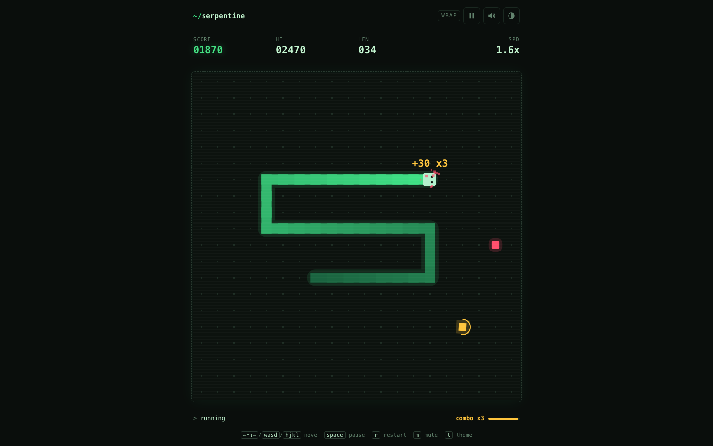
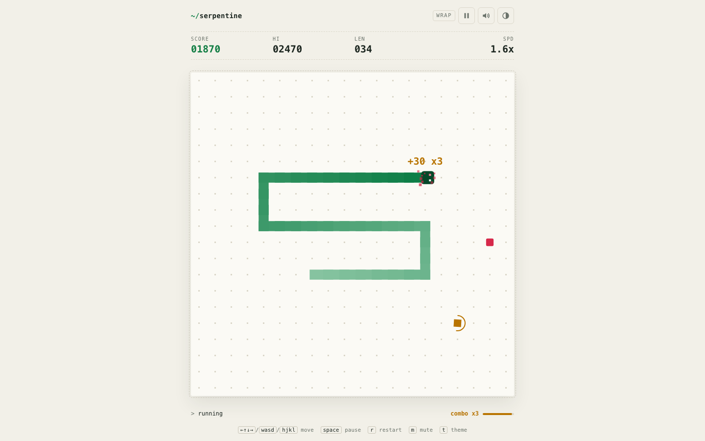
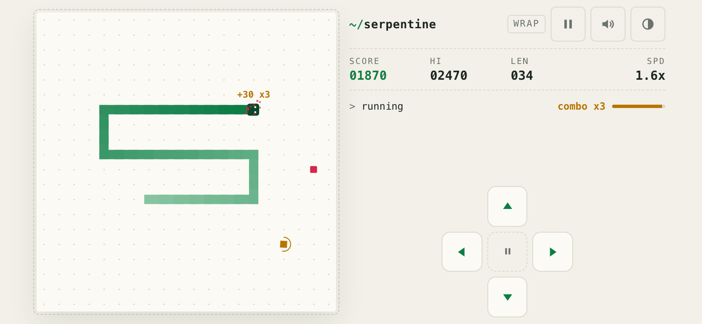
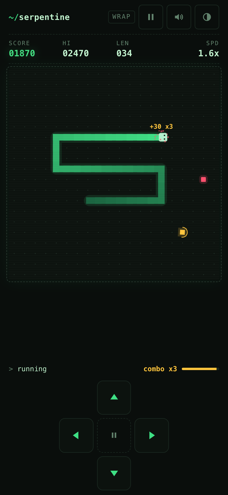

# Serpentine

A minimal, terminal-style Snake game in plain HTML/CSS/JS. It has no dependencies and no build step, and it installs as an offline-capable PWA.

**▶ Play it: https://jgohil07.github.io/SerpentineGame/**

<p align="center">
  
</p>

| Light theme | Phone, landscape |
| --- | --- |
|  |  |

<p align="center">
  
</p>

## Run locally

From the repository root:

```bash
python3 -m http.server 8000
```

Then open: `http://localhost:8000`

ES modules and the service worker need HTTP, so opening `index.html` straight from the file system (`file://`) won't work.

## Manual verification checklist

- Movement works with arrow keys, WASD and HJKL. Two quick turns within one tick both register.
- On touch devices, the on-screen D-pad and swiping on the board move the snake.
- Snake grows by one segment after eating food.
- Food scores 10 × the combo multiplier. (v1 scored 1 per food.)
- In **wrap** mode the snake wraps from one wall to the opposite wall. In **classic** mode, hitting a wall ends the game.
- Game ends on self collision. Moving into the cell the tail is leaving is allowed.
- Pause/Resume works via button, Space, P and Esc. The game pauses itself when the tab is hidden or the window loses focus.
- Restart (R or the button) resets board, score, and state.

## Features

- **Two modes:** *classic* (walls kill, solid outline) and *wrap* (edges loop, dashed outline). Each mode keeps its own best score.
- **Scoring:** food is worth 10 × combo. Eat the next food within its window (shortest path + 8 ticks) to raise the combo, up to ×5. Timed bonus food (the gold diamond with a countdown ring) is worth 50 × combo and doesn't make the snake longer.
- **Speed:** starts at 140ms per tick (the v1 speed) and eases toward 60ms as you eat.
- **Physics:** fixed-timestep simulation with interpolated rendering, so movement is smooth at any refresh rate. A 3-turn input buffer means quick turns are never dropped, and inputs can't reverse the snake into itself. Filling the board is a win.
- **Game feel:** synthesized chiptune sound effects (no audio files), vibration on phones, particles, score pop-ups and a shake on death. Motion effects switch off under `prefers-reduced-motion`.
- **Responsive:** the board is always a whole number of pixels per cell and as large as the viewport allows. Layout is either stacked or side by side (landscape phones, tablets, short windows), whichever gives the bigger board. Touch devices get a D-pad and swipe steering; desktops get a keyboard legend.
- **Themes:** dark "phosphor" and light "paper". Follows the system setting until you choose one; no flash of the wrong theme on load.
- **PWA:** manifest, icons and a network-first service worker, so the game can be installed and played offline.
- **Hardening:** strict Content-Security-Policy (no inline scripts or styles), storage that survives errors (private mode, corrupt data), and accessible labels and announcements.

## Controls

| Action | Keyboard | Touch |
| --- | --- | --- |
| Steer | ←↑↓→ / WASD / HJKL | swipe on the board, or the D-pad |
| Start | Space, Enter or any arrow key | START, or any swipe/D-pad press |
| Pause / resume | Space, P, Esc | pause button (top bar or D-pad centre) |
| Restart | R | restart / retry buttons |
| Mode (on the menu) | 1 classic, 2 wrap | mode buttons |
| Mute / theme | M / T | top-bar buttons |

## Tests

```bash
python3 tests/run.py                     # all suites (needs Google Chrome)
python3 tests/run.py --filter layout     # a subset, matched by name
python3 tests/run.py --screenshots out/  # also capture screenshots at common sizes
```

`run.py` uses only the Python standard library. It serves the project, runs `tests/index.html` in headless Chrome and exits non-zero if anything fails. You can also open `http://localhost:8000/tests/` in a browser. The suites:

- `tests/logic.test.js`: the rules (movement, input buffer, walls, collisions, combo, bonus, win, speed), a 240-game randomized invariant check, and a bot that must clear a 6×6 board.
- `tests/e2e.test.js`: the real game in an iframe, driven by keyboard, click, pointer and visibility events.
- `tests/layout.test.js`: 16 desktop, phone and tablet viewports, checking for no overflow, no overlap, whole-cell boards, and every overlay screen fitting inside the board.

Two URL parameters exist for testing: `?seed=N` makes food placement reproducible, and `?debug` exposes `window.__serpentine`. `?input=touch|desktop` forces a layout.

## Deploying

Serve the folder as static files over HTTPS (any static host works). If you change the list of files the service worker precaches, bump `CACHE_VERSION` in `sw.js`.

## Project structure

```
index.html            markup, CSP, PWA metadata
manifest.webmanifest  install metadata
sw.js                 offline support (network-first)
icons/                favicon (SVG) and app icons (PNG)
src/boot.js           runs before first paint: theme, input type, layout
src/game.js           loop, phases, HUD, settings, layout sizing
src/snakeLogic.js     pure, deterministic game rules
src/renderer.js       canvas drawing, interpolation, effects
src/input.js          keyboard, swipe, D-pad
src/audio.js          WebAudio sound effects
src/storage.js        localStorage wrapper that never throws
src/styles.css        theme and responsive layout
tests/                browser test suites and the headless runner
docs/screenshots/     images used in this README
```
